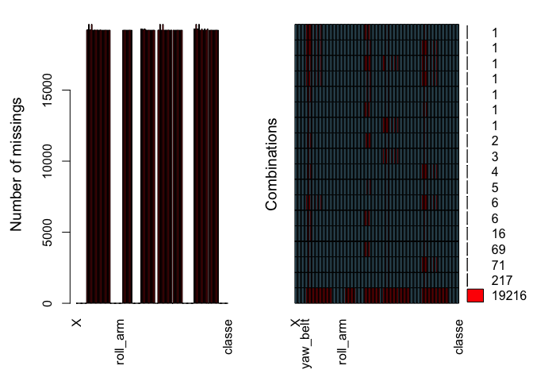
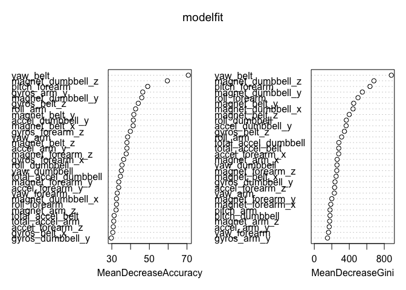
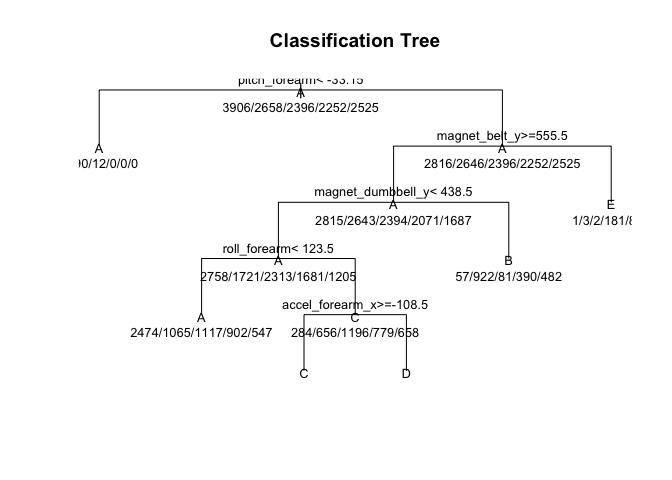
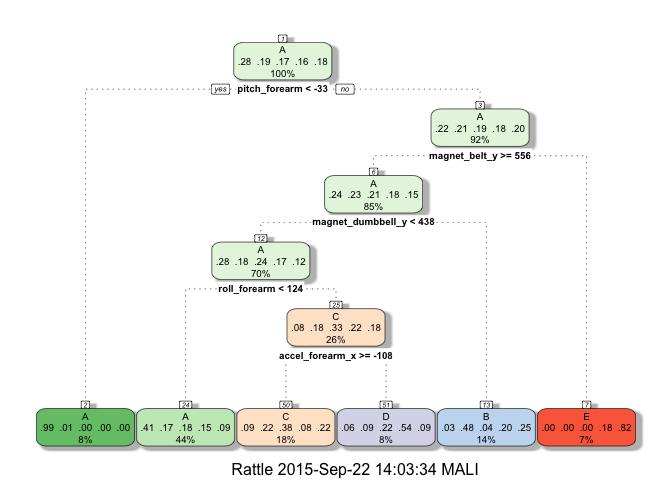

##Background
---
Using devices such as Jawbone Up, Nike FuelBand, and Fitbit it is now possible to collect a large amount of data about personal activity relatively inexpensively. The goal of this dataset is to use data from accelerometers on the belt, forearm, arm, and dumbell of 6 participants who performed activities using barbellcorrectly and incorrectly in 5 different ways and evaluate and quantify how well they perform the activity
---
##Report summary
---
Based on the two machine learning models tested, the random forest method gave more accuracy in terms of determining the evaluating and quantifying the activity with all the data that was collected.  Some of the key features or data that were key in determining the final output were yaw_belt, magnet_dumbbell_z, gyros_arm_y, magnet_dumbbell_y, pitch_forearm.  The detailed methods foolowed in data clean up and models tested and prediction are described below.  Based on the modeltested with testing data sets the levels were predicted as Levels: A B C D E
---
title: "PML_assignment"
output: html_document

pandoc_args: [
"+RTS", "-K100000m",
"-RTS"
]
---


###Data Clean up and Processing
---
First and foremost is to explore the datasets and handle the missing values.  The dataset from column 9 and above needs to be converted to numeric. There are lots of missing data.  Missing data is shown in the figure. Some columns(features) as shown in the figure are the missing values n the datasets.  All the columns with missing data is removed.  Some of the irrelevant features are removed from this dataset. Some features that have datasets like ids are removed.  Basically the first 8 columns are removed. The features that are highly correlated with a cut off grreater than 80% are removed.


```r
pml_training <- read.csv("~/Documents/Coursera/Practical Machine learning/Assignment/Practical-machine-Learning/pml-training-1.csv", na.strings=c("NA","#DIV/0!", ""))
#head(pml_training)
dim(pml_training)
```

```
## [1] 19622   160
```

```r
library(data.table)
library(VIM)
```

```
## Loading required package: colorspace
## Loading required package: grid
## VIM is ready to use. 
##  Since version 4.0.0 the GUI is in its own package VIMGUI.
## 
##           Please use the package to use the new (and old) GUI.
## 
## Suggestions and bug-reports can be submitted at: https://github.com/alexkowa/VIM/issues
## 
## Attaching package: 'VIM'
## 
## The following object is masked from 'package:datasets':
## 
##     sleep
```

```r
aggr(pml_training, prop=FALSE, numbers=TRUE)
```

 

```r
Training2 <- pml_training
for(i in c(8:ncol(pml_training)-1)) {pml_training[,i] = as.numeric(as.character(pml_training[,i]))}
training_remov_na <- Training2[ , colSums(is.na(Training2)) ==0]
dim(training_remov_na)
```

```
## [1] 19622    60
```

```r
remove = c('X', 'user_name', 'raw_timestamp_part_1', 'raw_timestamp_part_2', 'cvtd_timestamp', 'new_window', 'num_window')
training.clean1 <- training_remov_na[, -which(names(training_remov_na) %in% remove)]
dim(training.clean1)
```

```
## [1] 19622    53
```

```r
Train1 <- training.clean1[complete.cases(training.clean1),]
#head(Train1)
dim(Train1)
```

```
## [1] 19622    53
```

```r
library(caret)
```

```
## Loading required package: lattice
## Loading required package: ggplot2
```

```r
corr <- cor(Train1[sapply(Train1, is.numeric)])
corr80 <- findCorrelation(corr, cutoff=0.80, verbose=TRUE)
```

```
## Compare row 10  and column  1 with corr  0.992 
##   Means:  0.27 vs 0.168 so flagging column 10 
## Compare row 1  and column  9 with corr  0.925 
##   Means:  0.25 vs 0.164 so flagging column 1 
## Compare row 9  and column  4 with corr  0.928 
##   Means:  0.233 vs 0.161 so flagging column 9 
## Compare row 36  and column  29 with corr  0.849 
##   Means:  0.251 vs 0.158 so flagging column 36 
## Compare row 8  and column  2 with corr  0.966 
##   Means:  0.239 vs 0.154 so flagging column 8 
## Compare row 2  and column  11 with corr  0.884 
##   Means:  0.221 vs 0.15 so flagging column 2 
## Compare row 21  and column  24 with corr  0.814 
##   Means:  0.194 vs 0.149 so flagging column 21 
## Compare row 34  and column  28 with corr  0.808 
##   Means:  0.185 vs 0.146 so flagging column 34 
## Compare row 25  and column  26 with corr  0.814 
##   Means:  0.154 vs 0.145 so flagging column 25 
## Compare row 19  and column  18 with corr  0.918 
##   Means:  0.096 vs 0.146 so flagging column 18 
## Compare row 46  and column  45 with corr  0.846 
##   Means:  0.11 vs 0.149 so flagging column 45 
## Compare row 46  and column  31 with corr  0.914 
##   Means:  0.091 vs 0.152 so flagging column 31 
## Compare row 46  and column  33 with corr  0.933 
##   Means:  0.07 vs 0.156 so flagging column 33 
## All correlations <= 0.8
```

```r
Train2 = Train1[, -corr80]
dim(Train2)
```

```
## [1] 19622    40
```
---
###Data Splitting for building a model
---
The reduced dataset Train2 is split into training and testing the model.


```
## [1] 13737    40
```

```
## [1] 5885   40
```
---
###Model Building
---
Two different models are constructed to check the variables that are the best predictors.  Random forest and a tree model is constructed using the training dataset
1. Random Forest model


```
## Loading required package: foreach
## Loading required package: iterators
## Loading required package: parallel
## randomForest 4.6-10
## Type rfNews() to see new features/changes/bug fixes.
```

```
## 
## Call:
##  randomForest(formula = classe ~ ., data = training, ntrees = 100,      importance = TRUE, allowParallel = TRUE) 
##                Type of random forest: classification
##                      Number of trees: 500
## No. of variables tried at each split: 6
## 
##         OOB estimate of  error rate: 0.82%
## Confusion matrix:
##      A    B    C    D    E class.error
## A 3902    3    1    0    0 0.001024066
## B   14 2633   11    0    0 0.009405568
## C    0   28 2363    5    0 0.013772955
## D    0    0   37 2211    4 0.018206039
## E    0    0    3    6 2516 0.003564356
```

```
##                             A        B        C        D        E
## yaw_belt             57.33771 54.49245 46.23468 59.90784 39.88412
## total_accel_belt     23.53174 25.79566 26.07819 26.34041 24.19385
## gyros_belt_x         19.56682 21.55973 26.69114 18.42779 22.24696
## gyros_belt_y         16.19896 21.21297 19.63767 18.23753 25.58395
## gyros_belt_z         29.31210 37.00704 32.14027 34.25856 37.81217
## magnet_belt_x        20.88997 32.70636 34.20795 26.14134 36.19475
## magnet_belt_y        31.32808 35.00488 33.93204 38.77306 34.21280
## magnet_belt_z        29.10720 31.78319 29.71922 35.69684 32.84238
## roll_arm             25.21468 36.07336 33.17454 39.06679 30.57724
## pitch_arm            19.00854 31.70144 24.79804 26.31560 21.66745
## yaw_arm              27.69144 32.94673 28.44570 34.03608 26.49455
## total_accel_arm      13.05476 28.25517 26.58115 26.33342 25.26719
## gyros_arm_y          23.68059 36.75592 30.57759 33.91142 28.21646
## gyros_arm_z          14.13748 19.82640 17.39005 17.02909 18.52596
## accel_arm_y          21.42522 30.23520 24.32069 27.11960 25.43924
## accel_arm_z          14.50458 25.69263 26.65261 25.99846 23.25403
## magnet_arm_x         20.85745 22.11325 24.81718 27.36131 20.17000
## magnet_arm_z         23.34504 30.48352 25.11171 26.10215 23.26273
## roll_dumbbell        26.80236 30.81912 33.51994 33.31987 30.28430
## pitch_dumbbell       12.72388 25.46683 20.28621 16.21448 18.50418
## yaw_dumbbell         22.33234 30.95008 32.19921 28.55149 30.15562
## total_accel_dumbbell 24.59913 31.70806 27.08968 27.13043 33.63656
## gyros_dumbbell_y     24.47533 25.70189 32.88614 24.50870 21.50268
## accel_dumbbell_y     30.58935 34.90547 34.98043 33.06963 32.62015
## magnet_dumbbell_x    27.08374 30.54427 35.36305 31.15035 26.85212
## magnet_dumbbell_y    36.17120 39.47469 48.23307 37.88792 36.20384
## magnet_dumbbell_z    49.80363 46.97222 53.39611 45.15864 45.06471
## roll_forearm         31.71326 27.89335 34.44244 27.46142 27.86797
## pitch_forearm        35.50844 43.22175 42.55262 41.49031 40.85091
## yaw_forearm          21.53556 27.55733 23.20661 25.39918 26.11960
## total_accel_forearm  21.85023 23.42129 23.35061 20.89346 19.89145
## gyros_forearm_x      15.58866 21.93985 25.19415 21.90779 21.39412
## gyros_forearm_z      19.32789 31.21298 26.20149 23.30972 22.55488
## accel_forearm_x      19.92545 28.51210 27.77704 33.26833 24.87953
## accel_forearm_y      21.76689 27.37089 28.47771 20.78511 23.97577
## accel_forearm_z      19.19316 27.05219 28.15206 24.57762 28.50250
## magnet_forearm_x     16.18170 23.09083 22.97436 20.11450 21.54421
## magnet_forearm_y     22.19801 29.16469 29.02186 26.39685 25.83732
## magnet_forearm_z     26.61625 32.48441 27.36352 32.09575 31.09826
##                      MeanDecreaseAccuracy MeanDecreaseGini
## yaw_belt                         70.73253        880.40778
## total_accel_belt                 31.24154        279.48580
## gyros_belt_x                     30.52253        111.91667
## gyros_belt_y                     26.07573        125.07647
## gyros_belt_z                     44.09995        344.31687
## magnet_belt_x                    41.37034        249.25635
## magnet_belt_y                    41.72543        449.91068
## magnet_belt_z                    38.04384        399.47124
## roll_arm                         42.67139        312.36400
## pitch_arm                        29.31928        179.55252
## yaw_arm                          38.43110        229.35777
## total_accel_arm                  31.03437        112.78608
## gyros_arm_y                      46.46987        150.71546
## gyros_arm_z                      26.98504         65.89200
## accel_arm_y                      38.03824        170.64918
## accel_arm_z                      27.33383        125.83344
## magnet_arm_x                     24.13988        261.26560
## magnet_arm_z                     32.28791        175.24492
## roll_dumbbell                    35.44411        366.20214
## pitch_dumbbell                   20.00043        179.23224
## yaw_dumbbell                     35.09556        259.61160
## total_accel_dumbbell             34.59663        280.76939
## gyros_dumbbell_y                 29.73769        236.41978
## accel_dumbbell_y                 41.46416        363.82195
## magnet_dumbbell_x                32.50612        442.90477
## magnet_dumbbell_y                45.94944        549.16769
## magnet_dumbbell_z                59.57992        681.56300
## roll_forearm                     32.50305        499.83878
## pitch_forearm                    49.11015        636.62012
## yaw_forearm                      32.90654        162.45639
## total_accel_forearm              28.05044        106.76615
## gyros_forearm_x                  36.31182         86.21231
## gyros_forearm_z                  39.87087         94.68656
## accel_forearm_x                  29.54653        278.79281
## accel_forearm_y                  33.66738        134.73384
## accel_forearm_z                  30.79144        232.01449
## magnet_forearm_x                 23.10999        188.20948
## magnet_forearm_y                 33.69986        200.09959
## magnet_forearm_z                 37.67077        256.95214
```

 

```
## [1] 0.9923534
```
2. Tree model

```
## n= 13737 
## 
## node), split, n, loss, yval, (yprob)
##       * denotes terminal node
## 
##  1) root 13737 9831 A (0.28 0.19 0.17 0.16 0.18)  
##    2) pitch_forearm< -33.15 1102   12 A (0.99 0.011 0 0 0) *
##    3) pitch_forearm>=-33.15 12635 9819 A (0.22 0.21 0.19 0.18 0.2)  
##      6) magnet_belt_y>=555.5 11610 8795 A (0.24 0.23 0.21 0.18 0.15)  
##       12) magnet_dumbbell_y< 438.5 9678 6920 A (0.28 0.18 0.24 0.17 0.12)  
##         24) roll_forearm< 123.5 6105 3631 A (0.41 0.17 0.18 0.15 0.09) *
##         25) roll_forearm>=123.5 3573 2377 C (0.079 0.18 0.33 0.22 0.18)  
##           50) accel_forearm_x>=-108.5 2530 1562 C (0.089 0.22 0.38 0.085 0.22) *
##           51) accel_forearm_x< -108.5 1043  478 D (0.058 0.09 0.22 0.54 0.092) *
##       13) magnet_dumbbell_y>=438.5 1932 1010 B (0.03 0.48 0.042 0.2 0.25) *
##      7) magnet_belt_y< 555.5 1025  187 E (0.00098 0.0029 0.002 0.18 0.82) *
```

 

```
## Loading required package: RGtk2
## Rattle: A free graphical interface for data mining with R.
## Version 3.5.0 Copyright (c) 2006-2015 Togaware Pty Ltd.
## Type 'rattle()' to shake, rattle, and roll your data.
```

 

```
## [1] 0.4924384
```

Random Forest method has a a OOB estimate of error rate of 0.57% and that is better than the tree method


```
## [1] 0.9923534
```

```
## [1] 0.4924384
```
With the test data, random forest method has 99.4% accuracy and the tree method has only 53.67%.  So Random forest method turns out to be a better model predictor


```
##  1  2  3  4  5  6  7  8  9 10 11 12 13 14 15 16 17 18 19 20 
##  B  A  B  A  A  E  D  B  A  A  B  C  B  A  E  E  A  B  B  B 
## Levels: A B C D E
```
